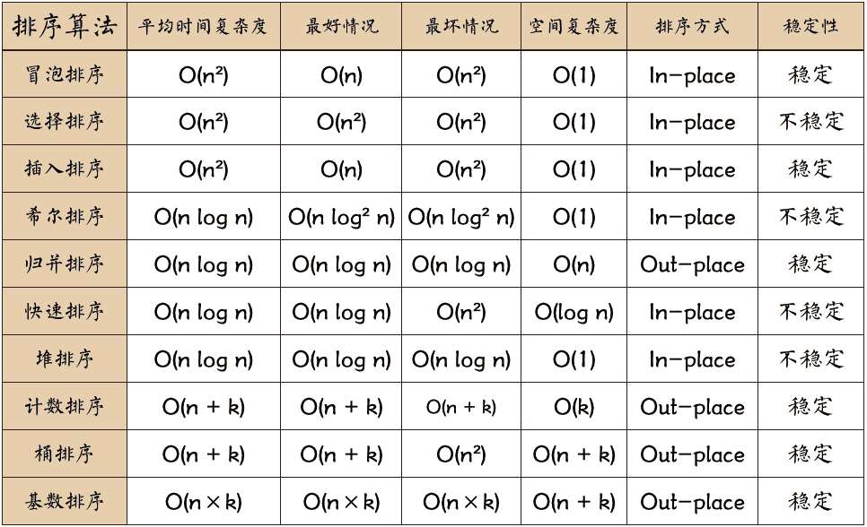

## python基础

1. 交换a,b的值的几种方法?
    ```python
    a = 1
    b = 2
    # 1
    a = a + b
    b = a - b
    a = a - b
    # 2
    a,b = b,a
    # 3
    a = a ^ b
    b = b ^ a
    a = a ^ b
    ```
2. 继承与类关系理解
    ```python
    class Parent(object):
        x = 1
    class Child1(Parent):
        pass
    class Child2(Parent):
        pass
    print Parent.x, Child1.x, Child2.x     # 1, 1, 1
    Child1.x = 2
    print Parent.x, Child1.x, Child2.x     # 1, 2, 1
    Parent.x = 3
    print Parent.x, Child1.x, Child2.x     # 3, 1, 3
    
    ```
3. python2中range返回的是列表，xrange返回的是生成器；python3中的range()相当于python2中的xrange(),并且删除了xrange()函数。
4. 如何将`[[1,2], [3,4], [5,6]]`展开成为`[1,2,3,4,5,6]` :
    * `sum([[1,2], [3,4], [5,6]], [])`
5. 字典如何按照其中一个键的值大小排序 `d1 = [{‘name’:‘alice’, ‘age’:38},{‘name’:‘bob’, ‘age’:18},{‘name’:‘Carl’, ‘age’:28}]`
    * `d1.sort(key=lambda x: x["age"])`
6. 如何将元祖 `("a", "b") 和 (1, 2)` 组成字典
    * `zip(("a", "b"), (1, 2))`
7. 生成器切片
    * itertools.islice(生成器对象，起始位置，结束位置)
8. 请将 `[ i for i in range(3)]` 改成生成器
    * `(i for i in range(3))`
9. 当前日期为20190530,要求写一个函数输出N天后的日期(比如N=2， 输出20190601)
    * ```python 
        date2 = date.today() + timedelta(days=n)
        print date2.strftime("%Y%m%d") 
      ```
10. readlines是将整个文件读取到一个迭代器中以遍历
11. except中return后还是会执行finally的代码的
12. 排序好的list如何打乱：`random.suffle([1,2,3])`
13. python中的print() <==> sys.stdout.write()
14. python2和python3的区别
    * py3只支持unicode类型的string，py2因为使用的是ASCII码作为的默认编码方式，所以支持str和unicode编码的string
    * py3的新式类需要继承object
    * py3缩紧更严格 1tap != 8 space
    * py3中for循环内部变量不会影响外面
    * py3 dict.keys()等方法返回的是生成器
    * py2中两个对象可以做对比，py3中只有两个对象是同一个数据类型才能比较
    * xrange() => range() xrange()取消
    * <> ==> !=
    * print xxx => print("")
    * 迭代器next() => next(iterator)
    * has_key() => in

---

## python高级及理解

1. 深浅拷贝
    1. 浅拷贝只会拷贝第一层，再多层的还是不变的。常见浅拷贝：切片，`copy.copy，list()`
    2. 深拷贝就是全部都拷贝一遍。`copy.deepcopt()`
1. python不允许程序员选择采用传值还是传引用。Python参数传递采用的肯定是“**传对象引用**”的方式。这种方式相当于传值和传引用的一种综合。
   如果函数收到的是一个**可变对象**（比如字典或者列表）的引用，就能修改对象的原始值－－相当于通过“**传引用**”来传递对象。
   如果函数收到的是一个**不可变对象**（比如数字、字符或者元组）的引用，就不能直接修改原始对象－－相当于通过“**传值**'来传递对象。
2. python对线程，进程，协程的理解
    1. **进程**：资源单位，由操作系统控制调度。正在执行的一个程序或者过程，进程之间不共享资源，进程间通讯手段：管道，队列，信号量等。
    2. **线程**：是cpu的最小执行单位，由操作系统控制调度。一个进程至少有一个线程，同一个进程里面的多个线程共享该进程的内存资源（此处会涉及到资源的抢夺），
        因此需要用到“锁”，来防止资源争抢而导致的死锁等问题，创建线程的开销远远小于创建进程的开销。
        1. 多线程就是允许一个进程内存在多个控制权，以便让多个函数同时处于激活状态，从而让多个函数的操作同时运行。
            即使是单CPU的计算机，也可以通过不停地在不同线程的指令间切换，从而造成多线程同时运行的效果。
        2. 在一些简单IO密集型操作中，如读写文件，可以通过多线程增加其工作效率。
    3. **协程**：实现单线程的并发，由用户自己通过程序来实现控制调度。**修改共享数据不需要加锁，切换开销小，更加轻量级**。
        缺点：本质是单线程下的并发，无法利用多核，可以考虑**多进程+协程**。
        1. 与**线程的抢占式调度**不同，它是**协作式调度**
        2. 在使用多线程的时，每个线程遇到IO的情况下，等待IO结束期间被闲置，这种情况被视为一种资源浪费。而协程不会也这种情况，
            **协程可以使一个线程切换任务，使一个线程分片执行任务**。
        3. 应用：而在爬虫中经常会遇到一些网络延迟的问题，导致线程切换，其间花费的开销是很大的。尤其当线程数很多的时间，
            **很大比例的时间都花费在切换在锁的操作上**。因此，不建议使用threading 多线程进行爬取，一般都是使用多进程配合协程。
3. 线程全局锁(Global Interpreter Lock),即Python为了保证线程安全而采取的独立线程运行的限制,说白了就是一个核只能在同一时间运行一个线程.
    **对于io密集型任务，python的多线程起到作用，但对于cpu密集型任务，python的多线程几乎占不到任何优势，还有可能因为争夺资源而变慢**。
    1. 任何Python线程执行前，必须先获得GIL锁，然后，每执行**100条字节码**，解释器就自动释放GIL锁，让别的线程有机会执行。
    这个GIL全局锁实际上把所有线程的执行代码都给上了锁，所以，多线程在Python中只能交替执行，即使100个线程跑在100核CPU上，也只能用到1个核。
    Python虽然不能利用多线程实现多核任务，但可以通过多进程实现多核任务。多个Python进程有各自独立的GIL锁，互不影响。
4. 闭包
    1.  在一个外函数中定义了一个内函数，内函数里运用了外函数的临时变量，并且外函数的返回值是内函数的引用。这样就构成了一个闭包。
5. 并行: 是指真正的同一时间都在执行，并发：是通过快速切换到达同时执行的效果，实际上cpu只能在同一时间点处理一个任务
6. 提升性能小方法
    1. 多使用局部变量
    2. 多使用多线程，多进程，协程等方式
    3. 对于部分要求比较高的代码可以改写成c/c++
    4. 多使用内置方法

---

## 数据库相关

### redis

1. redis的持久化：
    1. **RDB**：将所有数据保存到一个dump文件中，定时保存，替换掉原来的RDB
    2. **AOF**：将所有redis服务器进行修改的命令都存在一个文件里，每秒钟同步一次，不过相对来说AOF比较大，速度会慢于RDB
    3. 一般会用**RDB全量同步，AOF增量同步**
2. redis采用了：**定期删除+惰性删除+内存淘汰机制**
    1. 定期删除：redis启用定时器，观察每个key是否过期，过期就删了，缺点：消耗CPU资源，有可能应该过期的key还在
    2. 惰性删除：每次调用key的时候，检查是否过期，缺点：有可能该key一直都在
 
### mysql

1. mysql中SQL的执行顺序：
    *. SQL的执行顺序：
    ```sql
    from---where--group by---having---select---order by
    ```
2. mysql为什么要用b+树作为索引结构
    * hash索引：
        * 是一种key-value的存储结构，没有顺序关系，所以只适用于精确查找，不适用于范围性区域性查找
    * 二叉树：
        * 解决了排序的问题，但是不平衡，可能最后就变成了链表
    * 平衡二叉树
        * 通过旋转解决了平衡的问题，但是旋转效率过低。
    * 红黑树
        * 通过严格舍弃的平衡和红黑节点的引入，解决了旋转效率太低的问题，但是树太高了，IO过多
    * B+树：
        * 在b树的基础上，非叶节点不存储数据索引，降低了树的高度，并且将叶节点实用指针连接成链表，范围查询更高效
3. sql中不走索引的查询
    1. like
    2. 索引列参与了计算，使用了函数
    3. 非最左前缀顺序
    4. where 对 null判断
    5. where !=
    6. or （至少有一个字段没有索引）
    7. 需要回表的查询结果集过大

---

## 数据结构与算法

1. 冒泡排序：轮询，前一个数大于后面的数则两个数交换位置。
2. 选择排序：轮询，把最小的移到左边。选择排序与冒泡排序有点像，只不过选择排序每次都是在确定了最小数的下标之后再进行交换，大大减少了交换的次数
3. 插入排序：将一个记录插入到已排序的有序表中，从而得到一个新的，记录数增1的有序表
4. 快速排序：通过一趟排序将序列分成左右两部分，其中左半部分的的值均比右半部分的值小，然后再分别对左右部分的记录进行排序，直到整个序列有序。
5. 堆排序：假设序列有n个元素,先将这n建成大顶堆，然后取堆顶元素，与序列第n个元素交换，然后调整前n-1元素，使其重新成为堆，然后再取堆顶元素，与第n-1个元素交换，再调整前n-2个元素…直至整个序列有序。
6. 希尔排序：先将整个待排记录序列分割成为若干子序列分别进行直接插入排序，待整个序列中的记录基本有序时再对全体记录进行一次直接插入排序。
7. 归并排序：把有序表划分成元素个数尽量相等的两半，把两半元素分别排序，两个有序表合并成一个


```python
# 快排
def partition(arr, low, high):
    i = (low - 1)  # 最小元素索引
    pivot = arr[high]
    for j in range(low, high):
        # 当前元素小于或等于 pivot
        if arr[j] <= pivot:
            i = i + 1
            arr[i], arr[j] = arr[j], arr[i]
    arr[i + 1], arr[high] = arr[high], arr[i + 1]
    return (i + 1)
# arr[] --> 排序数组
# low  --> 起始索引
# high  --> 结束索引

# 快速排序函数
def quickSort(arr, low, high):
    if low < high:
        pi = partition(arr, low, high)
        quickSort(arr, low, pi - 1)
        quickSort(arr, pi + 1, high)
arr = [10, 7, 8, 9, 1, 5]
n = len(arr)
quickSort(arr, 0, n - 1)

```

---

## 逆向相关

1. Xposed核心原理
    1. 修改/system/bin/app-process程序，在android执行第一个程序zygote之前进行捕获，改变执行流程，进入到自身的main函数体内。
    2. zygote是整个系统创建新进程的核心进程，所有的应用都是由zygote fork而来的，因此能通过这个对应用程序进行hook
2. Xposed框架的核心思想
    1. 在于将普通的java函数注册成本地的JNI方法，以此来实现hook


