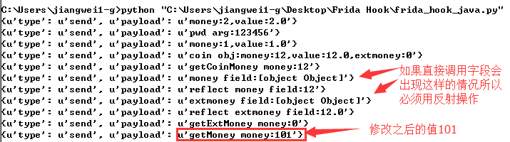
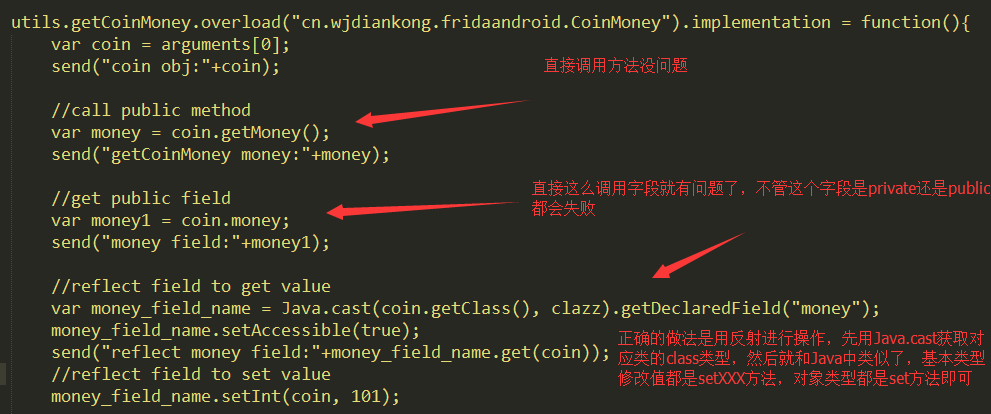

## Frida 安装配置
这里就不多介绍这些配置的信息了，如果需要咨询可以出门左转（百度），出门右转（Google）都可以哦～


## 启动Frida

1. 打开之前安装配置好的server并且做好端口映射。
    ```bash
    adb shell
    su
    ./data/local/tmp/fs64   # 这里的fs64就是你上传到手机上的frida-server64，根据不通手机启动不同的server哦。
    # 这里另开一个bash
    adb forward tcp:27043 tcp:27043
    adb forward tcp:27042 tcp:27042
    ```
2. 启动你手机上要hook的app，并且在adb中ps查看程序的名称，将其配置到py文件中或者添加到命令启动中。 

3. 这里有两种方式启动frida的hook程序，主要是以下几种启动的方式。本文偏向py文件启动方式（萝卜青菜各有所爱嘛）。
    1. 通过py文件+js程序启动。
    2. 通过在命令行中输入命令启动。 
    
## Frida内使用过程中js和Java转换时会遇到并且解决的问题

在使用frida的时候，一定会遇到的问题：
1. 调用app封装好的函数：
    ```js
    // 这里的实例化可以应用在各个地方，只要你实例化的时候参数传入正确，且和后续逻辑实现关联性地方已经配置好。
    Java.perform(function () {
        var AOPM = Java.use('com.xxx.xxx.xxx.xxx.xxx.xxxx');
        var instance = AOPM.$new("参数1", "参数2");
        send(instance.test());
    });
    ```
2. 内部类的调用
    ```js
    // 一般实践是在类中存在内部类的时候，使用$符号连接，这里需要注意实例化后的并不是HttpUtils,而是内部类:MyXXXXTrustManager
    var MyXXXXTrustManager = Java.use('com.xxxx.open.utils.HttpUtils$MyXXXXTrustManager');
    // 而且在使用过程中发现并不能成功实例化，可以通过报错查看是否需要添加参数进行实例化。类似：
    var rpc_config = XXXRpcConfig.$new("https://mobile.xxx.com/xxx.htm");
    var rpc_config$1 = XXXRpcConfig$1.$new(rpc_config);
    // 也就是先实例化外层类之后实例化内存类，并且将外层类的实例传参给内部类。
    ```
3. frida查看map内容, 因为map并不是String类型或者其他能print出来的类型，所以打印出来可能是Object或者其他，可以尝试这个方式将map输出出来。
    ```js
    var result = "";
    var keyset = map.keySet();
    var it = keyset.iterator();
    while(it.hasNext()){
        var keystr = it.next().toString();
        var valuestr = map.get(keystr).toString();
        result += keystr + "=" + valuestr + "\n";
    }
    send("result:"+ result);
    ```
4. map转json 这个是问题3的另一种解决办法。
    ```js
    function MapTOJson(m) {
        var str = '{';
        var i = 1;
        m.forEach(function (item, key, mapObj) {
            if(mapObj.size == i){
                str += '"'+ key+'":"'+ item + '"';
            }else{
                str += '"'+ key+'":"'+ item + '",';
            }
            i++;
        });
        str +='}';
        console.log(str);
        return str;
    }
    ```
5. bytes转String类型
    ```js
    var String = Java.use("java.lang.String");
    var str = String.$new(mRpcRequest.getDatas());
    mRpcRequest.getDatas() // 打印出来是object 其实是bytes类型！！

    ```
6. byte array 转 String 避免报错：can’t decode byte 0xc0 in position 5049, 思路：转16进制在打印字符串
    ```js
    function toHexString(byteArray) {
         return Array.prototype.map.call(byteArray, function(byte) {
         return ('0' + (byte & 0xFF).toString(16)).slice(-2);
          }).join('');
       }
    ```
7. hookJava类的构造方法（方法和类名一样（python中的init））
    ```js
    xxxx.$init("int", "java.lang.String").implementation = function(a, b){};
    ```
8. 记录下别人总计的经验哈哈～

    ```
    https://blog.csdn.net/jiangwei0910410003/article/details/80372118
    
    第一、Hook类的构造方法和普通方法，注意构造方法是固定写法$init即可，获取参数可以通过自定义参数名也可以直接用系统隐含的arguments变量获取即可。
    第二、修改方法的参数和返回值，直接调用原始方法传入需要修改的参数值和直接修改返回值即可。
    第三、构造对象使用固定写法$new即可。
    第四、如果需要修改对象的字段值需要用反射去进行操作。
    第五、堆栈信息打印直接调用Java的Exception类即可，通过adb logcat -s AndroidRuntime来过滤日志信息查看崩溃堆栈信息。
    总结：记得用Java.use方法获取类的类型，如果遇到重载的方法用overload实现即可。
    ```
9. 如果想要hook的内容是类似这个样子：
    `LoggerFactory.getTraceLogger().debug("UserSdkLoginBiz", "registerLoginFragment”);`
    是直接调用方法去获取instance 之后在调用debug，正常hookdebug方法是不行的！！！我们需要先hook getTraceLogger 方法，将返回的实例方法指向我们通过hook改写后的实例的class，这样 我们就能hook到了！！！！！

10. **Java反射，通过反射获取某个实例的属性值（包括私有属性）应用场景：某些属性值打印出来是Object，这一招可以治90%** 

    `对于私有属性，我们可以用Java反射的方法设置。
    在Java反射中，通过Java.cast(m.getClass(),clazz).getDeclaredField('num')，m为一个实例化对象，后面getDeclaredField可以获得属性。通过Java.use('java.lang.Class');获取类的构造器
    这里，通过属性的get(ObjectsInstantiated)可以获取值，通过属性的setInt(ObjectsInstantiated，value)可以设置一个对象的属性值。ObjectsInstantiated为一个对象。
    这里，对于反射后的值，用console.log可以很好的输出值，而send在此处会打印对象。`
    
    
    
    ```js
    // 例如下面这种情况，想通过hook改变登陆的账号。
    var username = "xxx"; 
    var loginAccount = Java.cast(loginParam.getClass(), clazz).getDeclaredField('loginAccount');
    loginAccount.setAccessible(true);
    loginAccount.set(loginParam, username);
    console.log(loginAccount.get(loginParam))
    ```
11. 获取method。
    ```js
    var userLogin = UserLogin.$new(context);
    var method = userLogin.class.getDeclaredMethods()[7];
    ```  
12. 获取当前的Context!!!
    ```js
    var curr_context = Java.use('android.app.ActivityThread').currentApplication().getApplicationContext();
    ```
13. 基本属性（在overload()的时候会用到）
    
基本类型| 缩写 | list缩写
:-------:| :--: |:---:
boolean|  Z   | [Z 
byte   |  B   | [B 
char   |  C   | [C 
double |  D   | [D 
float  |  F   | [F 
int    |  I   | [I 
long   |  J   | [J 
short  |  S   | [S 
    
    
## Frida一些经验使用思路

- 首先，当你选择hook一个app的时候，要分清版本，最好是选择app向下兼容的低版本，既能够符合你hook要求，不需要脱壳就可以反编译直接看到源码最好，并且对方的服务支持该版本的兼容（当然不宜太低，有可能搞着搞着人家就不兼容了哈哈，我就有遇到过....）

- **如果是大厂，建议直接看其log打印逻辑**

- 尽量使用console.log()来打印一些内容，因为send()经常是打印不出来自定义类的内容的。

- 很多apk会以debug参数来判断是否是测试环境，所以可以hook那个类的类属性或者函数返回debug=True,之后会看到很多debug下才打印的内容！

- 一个完善的apk，各个模块都是封装好的，因此你甚至可以使用其中的模块去发送你的请求，只要你的代码理解到位。

- 在实例化一个类并且将其作为参数传给下一个方法的时候，要注意该类中的类属性变化！

- 注意类的命名，
    - 比如：xxxxPb, 这种是一种类似json的传输数据的格式，protobuffer, 可以尝试百度。
    - xxxRpcXXX, 记得百度, 收益多多。
    


