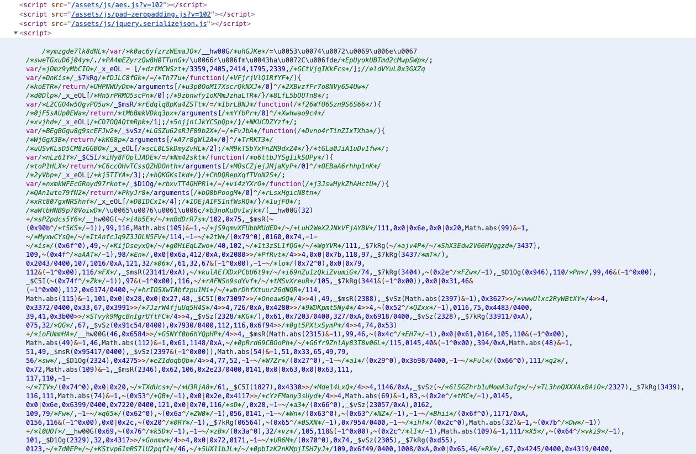

## 目标网址

**aHR0cCUzQS8vNTkuNTAuMTMwLjE3MSUzQTcwMDMvJTIzcGFnZTE=**

## 网址解说

该网址是一个社保登陆网址，同事在破解的过程中遇到问题，我刚好帮忙看了下，觉得还是蛮典型的eval类网址，
决定放到blog上好好说一下，同时也记录一下破解流程，但是没有具体的实现过程，毕竟是帮同事破解，给个思路就好了哈哈

## 破解流程

### 第一步：分析登陆请求

`我们打开网址，将cookie什么的去除后，就可以打开F12（也可以使用charles/fiddler等）开始尝试抓包`


由此可见有四个参数分别是：
1. account:用户名加密
2. pwd:密码加密
3. captcha: 图片验证码
4. sbklqq: 目前来看是一个固定的值

那么我们把分析指向account和pwd的密码加密。

### 第二步：定位加密位置

`定位具体加密位置的方法有很多，这里只是阐明一种比较简单的方法，各位大神有其他办法可以自行取舍`
#### == 1 ==
在这里我们直接全局搜索：**auth/submitLogin** (请求url的一部分)

#### == 2 ==
很明显我们定位到了发送ajax请求的地方，并且其中有`crypto1(formData);` 大概就是将明文formData加密。

#### == 3 ==
在加密点打一个断点之后跟进发现：

大家很容易看出这是aes加密的，但是有几个点可以注意一下。
    1. 该段js没有文件名，也就是并不是网页上发送ajax等请求获取响应出现的js。
    2. 通过多次尝试发现其中`parse("03113633C9HBRNKD")` 中的字符串每次都不一样，因此应该是一个动态生成的值。
    3. 通过**crypto1**全局搜索，除了定位加密位置的那个以外是没有结果的。
#### == 4 ==
根据之前的分析与推测，我们大胆假设: **该段js是通过eval出来的代码，并且每次都会不一样。**

### 第三步：定位具体原代码位置

接下来有两个思路：
1. 通过页面中的js请求响应，寻找具体代码位置： 
    观测网页中所有的js，看哪个js会每次都有变化，一般来说，同一个url对应的js永远都是一样的，就比如一些大厂会使用一些时间戳后几位等数字结尾url，就可以反馈回不同的js，以达到混淆的目的。但是这种情况找遍了所有的js url都没有。因此直接定位到网页的原html中。
2. 因为之前大胆猜测该网页代码是通过eval实现的解密，因此，我们可以使用：Tampermonkey(油猴插件)，hook该eval函数，就可以了。
    具体hook代码：
    ```js
    // ==UserScript==
    // @name         eval
    // @namespace    http://tampermonkey.net/
    // @version      0.1
    // @description  try to take over the world!
    // @author       You
    // @match        http://59.50.130.171:7003/#page1
    // @grant        none
    // ==/UserScript==
    
    (function() {
        'use strict';
    
        window.__cr_eval = window.eval;
        var myeval = function(src) {
            console.log(src);
            console.log("*************** eval end *****************");
            return window.__cr_eval(src);
    
        };
    
        var _myeval = myeval.bind(null);
        _myeval.toString = window.__cr_eval.toString;
        Object.defineProperty(window, 'eval', {value: _myeval});
    
        window._cr_func = window.Function;
        var my_func = function() {
            var args = Array.prototype.slice.call(arguments, 0, -1).join(",");
            var src = arguments[arguments.length - 1];
            console.log(src);
            console.log("***************** Function End *******************");
            return window._cr_func.apply(this, arguments);
    
        };
    
        my_func.toString = function() {
            return window._cr_func + "";
        };
    
        Object.defineProperty(window, "Function", {value: my_func});
    
    })();
    ```
不管通过哪一个方法我们最后都会定位到：


### 第四步：分析具体代码
`分析代码也可以分多种方法，这里仅仅是个人喜好`
找到代码后，我们直接在代码的第一行打断点进行分析，通过油猴找到代码相对来说分析简单一点，直接在hook代码中添加debugger；就调试可以了。

通过调试我们很容易发现：


那么我们需要做的就是，每次对该网站的源码进行分析，将该段代码拿下来，通过node原生的eval函数还原加密后的内容，拿到parse中的两个值。
具体的加密代码函数实现都在请求中有具体代码，全局搜索就好了，就不再细说了～

## 总结
动态的数值总会有他动态的原因，无外乎就是：
1. 通过请求动态返回不一样的值
2. 通过浏览器指纹生成动态不一样的值
3. 通过时间戳生成
4. 通过鼠标坐标轨迹等生成
5. **可能还会有别的但是总归是有源头的，是有迹可循的，需要的就是耐心的去寻找，不放过一点蛛丝马迹!**


