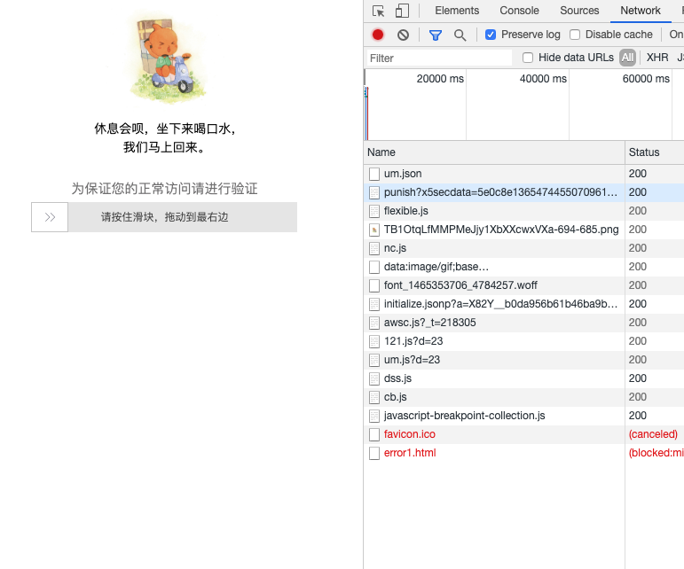
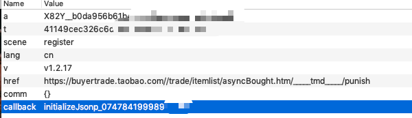
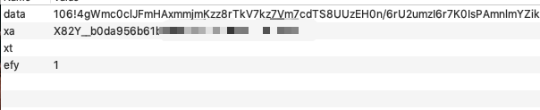
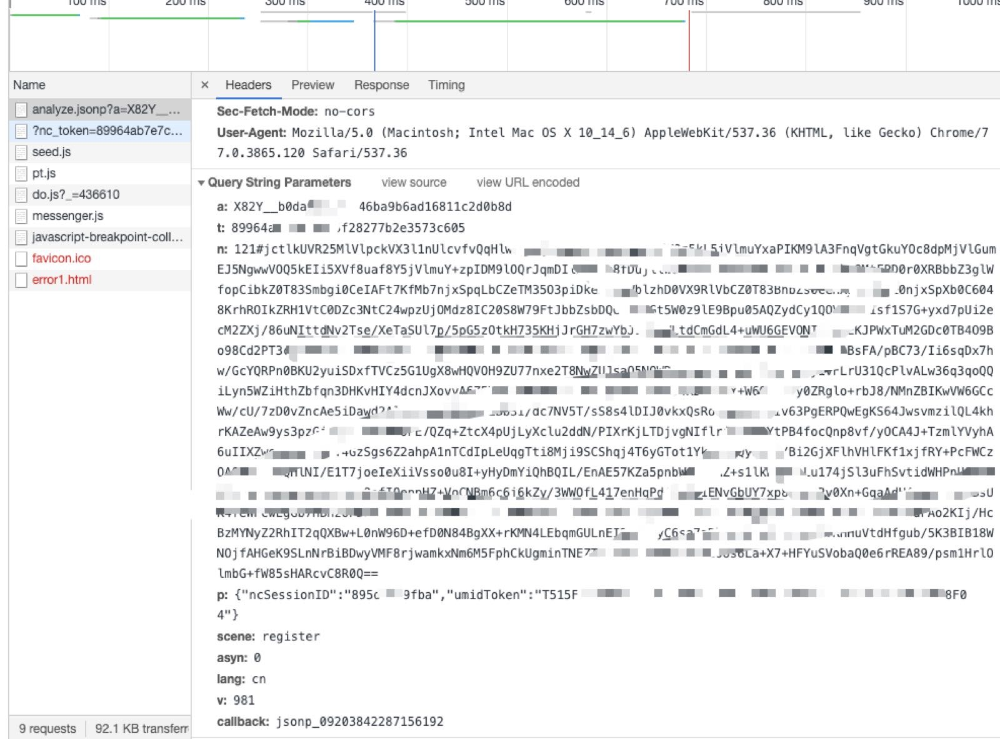
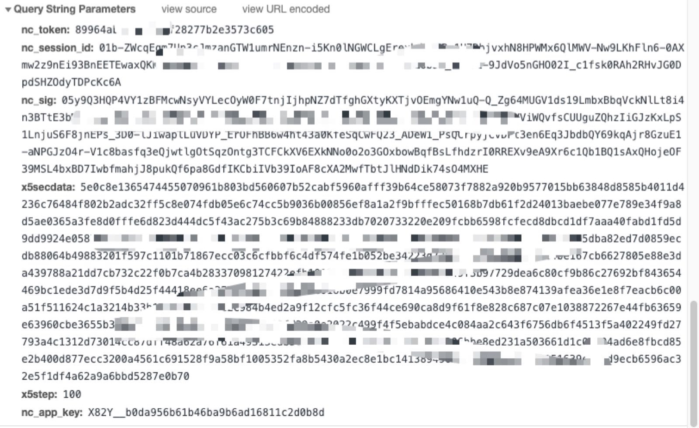
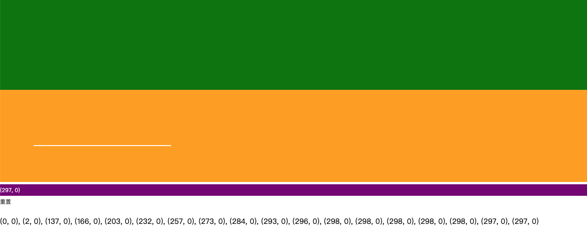

## 前言

好久没有更新，今天上班突然觉得自己的博客也应该开源一些爬虫小技巧，分享一些自己研究的知识体系，所以跑来更新下自己的blog...

因此本文主要讲述某里系滑块的的过滑块小技巧，也算是对之前一段时间自我探索学习的小总结。

--- 

## 某里系滑块特点

先上一张图片来康康：



可以看到，某里系的滑块特点是从左滑动到右侧，长度固定

--- 


## 请求分析：

#### init请求



```js
":path: /nocaptcha/initialize.jsonp?a=X82Y__b0da956b61b46ba9b6ad1xxxx&t=41149cec326c6d29502db6xxxx&scene=register&lang=cn&v=v1.2.17&href=https%3A%2F%2Fbuyertrade.taobao.com%2F%2Ftrade%2Fitemlist%2FasyncBought.htm%2F_____tmd_____%2Fpunish&comm={}&callback=initializeJsonp_07478419998937784"
```

分析：这个请求大概是在对a、t等参数，对应在后台做一个init初始化操作，返回值是success表示成功。

#### um.json



```js
":path: /service/um.json"
```

分析：该请求通过浏览器指纹+106.js加密生成了data，联合xa等参数发送获取
```
{
	"tn": "T3801AC3D4411735E85E30479E1601F41AF516A0DC54D8E920BCA87DB3B",
	"id": "GBAAC1F04B46109CB17A4E7BD9A7C7993299CDA"
}
```
tn参数我们在这里称作：umidToken

#### analyze.json



response: 
```
jsonp_08140153582164897({
	"result": {
		"csessionid": "01RRUxCOHjjWQsrvhNyesrm5q3fvZiRM-yiAchLD75G6k3Tc4RE4rFpIiLECALjVvrN8HPWMx6QlMWV-Nw9LKhFln6-0AXmw2z9nEi93BnEEQPbBLlr2PckPBLKwjpV3H4pCEcEeTDwXakZOY0jM4N8gIyq3UZob3-_mXhs1-9JdVo5nGHO02I_c1fsk0RAh2RHvJG0DpdSHZOdyTDPcKc6A",
		"code": 0,
		"value": "05y9Q3HQP4VY1zBFMcwNsyVYLecOyW0F7tnjIjhpNZ7dTITO0kjIJbMUq1YPKpLKUt91dO9Y7vuyt6lIr5Cr1zFyPwidbGwLZ2iFyhIETs8Jwh-2lgVEM0BA79hCH7APWw1d0fH20Gc5FDRFGCmxZRmJJ-qMwfdeLdLQe8ngczTbYbfl6CDSkTTTGuiHleex0HhzIiGJzKxLpS1LnjuS6F8jnEPs_3D0-lJiwaplLuVDbtTfdVFhHBl75gmyeFyeqpe9NVMUwu6jouW5gglIjm5CjCvDPt3en6Eq3JbdbQY69kqAjr8GzuE1-aNPGJzO4r-V1c8basfq3eQjwtlgOtSqzOntg3TCFCkXV6EXkNNo0o2o3GOxbowBqfBsLfhdzrrLGQ3VIig3lYt9Fb7uEaf1sAxQHojeOF39MSL4bxBD4ZiPo5AJ-MlVqerM3bcI0ion0x0HSRajXMmL7QG1RUvkTasnVFkb_UTtg97OOGLk4"
	},
	"success": true
});
```

分析： 

1. 当滑块滑动成功后，首先发送了这样的一个请求。

2. 该请求中的a、t、umidToken、callback参数在上面请求和url中存在。

3. 请求中的n是由121.js和浏览器指纹+滑动轨迹加密生成。

4. ncSessionID当debug一下发现生成规则是:
```js
getNcSession = function(e) {
    return parseInt(e.offsetWidth + "a" + e.offsetHeight + "a" + this.getElementLeft(e) + "a" + this.getElementTop(e), 11).toString(16)
}
```
其余参数固定不变。

#### verify



response
```
set-cookie: x5sec=7b2274726164656d616e616765723b32223a223032303830653238336337633639393635626263373935646161303261306362434c6942762b3046454f7559362b44352b63586630514561444449794e5467324e5441794d4445374d513d3d227d; Max-Age=1800; Expires=Wed, 23-Oct-2019 03:24:13 GMT; Path=/
```

分析：
1. 这是发送的最后一个请求，可以获取cookie，当这个cookie设置进入浏览器，在半小时内该用户携带cookie访问的话就不会出现滑块了（正常情况下）。
2. 该请求中的nc_sig和nc_session_id是analyse.json请求的响应内容。
3. 该请求中的x5secdata存在于h5中的form中的一个值，x5step不变，nc_app_key存在于h5中,token是从最开始一直跟下来的t。

如此看来，某里的滑块整体请求已经顺了下来，那我们来分析下，哪里我们可以做到，哪里做不到。


--- 

## 破解滑块逻辑

通过将滑块的主页down下来到本地，起一个web服务，使um.json之前的请求让其自动发送，将主页中的部分Ajax请求修改。

由此获得参数：umidToken, token，a，callback等

随后我们通过puppeteer+人类模拟轨迹 过滑块，自动发送修改后的Ajax请求(analyse)。但是不发送(verify)，我是通过程序发送的verify，并且成功获取verify请求相应中的set-cookie的值。

这就是破解滑块的基本逻辑。

具体呢我就不帖代码了，本次破解也只是个人技术创新于探索，请勿用于商业活动范围，后果自负。

不过呢，我这里可以给大家分享一个获取人类滑动轨迹的方法。

--- 


## 获取人类滑动轨迹

当你破解了很多滑块的时候，你会发现一个问题，就是他们的轨迹生成始终是通过间隔截取滑动位置定位的。而且，你会发现每次的间隔一般都在0.03s

因此，我写了一个h5，记录自己滑动轨迹。

效果图:



这个h5可以截取你在绿色框框中滑动的轨迹显示在黄色框框中，并且以每0.03s的间隔截取你的横纵坐标差值。

我的轨迹就是通过这个生成的，百试不厌！基本100%通过！

如果你足够了解h5, 你甚至可以将滑块代码添加进来，这样可以更方便获取滑动轨迹值。

以下是滑动轨迹获取代码：
```html
<!doctype html>
<html lang="zh">
<head>
    <meta charset="UTF-8">
    <title>log_tracks</title>
    <script src="https://cdnjs.cloudflare.com/ajax/libs/jquery/3.3.1/jquery.min.js"></script>
    <style>
        *{
            margin:0;
            padding:0;
            border:0;
        }
        .track-monitor{

            background-color:orange;
        }
        .track-pad{

            height:200px;
            background-color:green;
        }
        .track-coordinate{

            background-color:purple;
            color:white;
            height:25px;
            line-height:25px;
            font-size:12px;
        }
        .track-coordinate-list{
            font-size:12px;
            width:100%;
            word-break:break-word;
        }
    </style>
    <script>
        window.addEventListener('load',function(){
            var pad = document.getElementsByClassName('track-pad')[0];
            var monitor = document.getElementsByClassName('track-monitor')[0];
            var coordinate = document.getElementsByClassName('track-coordinate')[0];
            var clist = document.getElementsByClassName('track-coordinate-list')[0];
            var reset = document.getElementsByTagName('button')[0];
            var context = monitor.getContext('2d');
            var cset = [];
            var startx = 0, starty = 0;
            $('div').mousedown(mouseState).mouseup(mouseState);
            function fixSize(){monitor.width = window.innerWidth;};
            function log(e){
                if(cset.length == 0){
                    context.moveTo(e.x,e.y);
                }else{
                    context.strokeStyle = 'white';
                    context.lineTo(e.x,e.y);
                    context.stroke();
                }
                if(e.x-startx == e.x && e.y-starty == e.y){
                    startx = e.x;
                    starty = e.y;
                }
                coordinate.innerHTML = '(' + (e.x-startx)+', '+(e.y-starty) + ')';
                cset.push(coordinate.innerHTML);
                clist.innerHTML = cset.join(', ');
            }
            function mouseState(e) {
                if (e.type == "mouseup") {
                    $('#logs').append('<br/>'+cset.join(', '));
                    clist.innerHTML = cset.join('');
                    cset = [];
                    pad.removeEventListener("mousemove", log);
                }
                if (e.type == "mousedown") {
                    startx = 0; starty = 0;
                    pad.addEventListener('mousemove',log);
                }
            }

            reset.addEventListener('click',function(){
                fixSize();
                cset = [];
                clist.innerHTML = '';
                coordinate.innerHTML='在绿色的方块中滑动鼠标';
            });

            fixSize();
        });
    </script>
</head>
<body>
    <div class="stage">
        <div class="track-pad"></div>
        <canvas width="100" height="200" class="track-monitor"></canvas>
        <div class="track-coordinate">在绿色的方块中滑动鼠标</div>
        <button>重置</button>
        <div>
            <div id="logs"></div>
            <div class="track-coordinate-list"></div>
        </div>
    </div>
</body>
</html>
```

----

## 总结

请勿用于商业用途，后果自负。
其实，滑块这种验证方式，还是又很多破解的方式的，只要探索对方后台逻辑，逆向思维，就可以找到其中的规律。
当然肯定又大佬们用js就强行搞定了淘宝的滑块，那我是没有任何脾气的，我本人也就只能想到这种方式破解，不喜勿喷。
我也是在爬虫道路上在摸索ing，如果有走在志同道合路上的朋友可以➕在下微信/QQ～  在下方有二维码～～～


