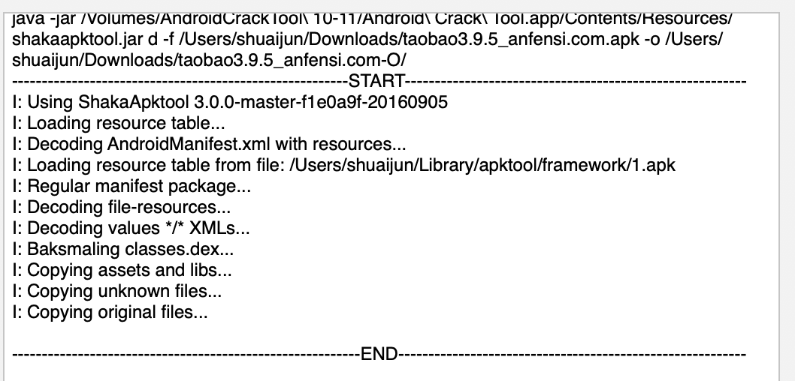
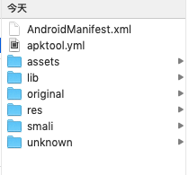
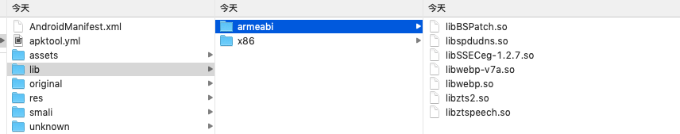

#### 常用工具下载地址
工具下载网址（win）：  
`https://down.52pojie.cn/Tools/Android_Tools/ `\
下载工具JEB（破解版）：\
`https://bbs.pediy.com/thread-230293.htm`

#### 反编译
1. jeb下载之后运行   `bash jeb_macos.sh`
打不开的话是java版本问题，切换成：  
jdk1.8.0_192.jdk 
就可以了。
如果进去了发现还是不好使：
`https://blog.csdn.net/u014288349/article/details/82897157`\
java 版本 1.5 == 5.0.xxx

2. 反编译app，尝试。
找到了工具Android Crack Tool 发现已经不在更新了， 最新版本的是16年的，下载完打开发现无法打开以损坏，输入命令\
`sudo spctl --master-disable`

3. 反编译的时候是傻瓜式流程：\

4. 反编译的结果：\

5. 接下来，下载jd-gui   \
 `brew cask install jd-gui`\
使用命令： \
`java --add-opens java.base/jdk.internal.loader=ALL-UNNAMED --add-opens jdk.zipfs/jdk.nio.zipfs=ALL-UNNAMED -jar /Applications/JD-GUI.app/Contents/Resources/Java/jd-gui-1.4.0.jar`\
打开jd-gui，将jar包拉进来。就能看到反编译出的java包了。

6. 
这个文件夹中，就是我们一般最难的部分，主要是存储着一些加密算法，也就是需要逆向的部分。

7. 我们使用工具逆向出java的源代码。=>使用d2j-dex反编译尝试 =>classes.dex => xxxxx_so.jar\
`sh d2j-dex2jar.sh -f ../classes.dex -o ../taobao_alipay_so.jar`

8. 使用android编译器（Android stutio xx）查看java 中的调用逻辑。从中我们可以找到我们需要的内容相关部分和他的部分生成逻辑（当然代码也可能在so文件中）
不过我们可以通过java的逻辑来进行hook操作，从而看到自己需要的参数的内容。

好随笔第一篇先写到这...